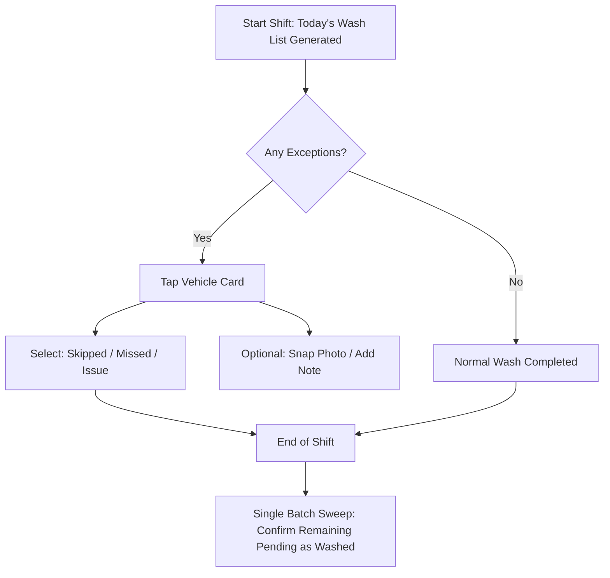
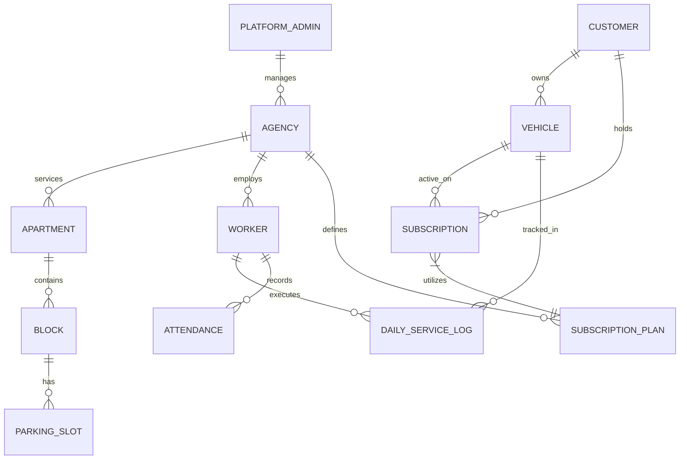

# SV Carwash Operations Platform: Deep Research & Architecture Analysis

## 1. Executive Summary & Core Identity Transition

The SV Carwash project is not merely a vehicle tracking app; it is a **Field Workforce, Subscription, Service Verification, and Operations SaaS Platform** specialized for high-density, recurring residential services (e.g., apartment complex vehicle cleaning). 

### The Core Shift: From Service App to Operations Engine
Most service applications fail because they are designed as **customer-facing booking systems**. For a recurring, low-margin, high-frequency model (like daily vehicle cleaning in a gated community), the bottleneck is **operational friction**. 

```
[Traditional System Model]  ---> Heavy Customer App ---> Worker Overhead ---> High Churn
[SV Carwash System Model]   ---> Zero-Friction Worker UX ---> High Data Integrity ---> Customer Trust
```

By prioritizing the worker's efficiency and treating attendance/service tracking as an automated side effect of their daily route, this platform solves the operational leakages (missed washes, disputes, worker fatigue, supervisor blindness) that plague manual recurring services.

Additionally, by designing the platform with a **Multi-Tenant, Multi-Agency architecture** from Day 1, SV Carwash can easily expand:
- **Horizontally**: Scaling to new gated communities/apartments.
- **Vertically**: White-labeling the software for other car wash agencies, pest control, housekeeping, waste management, or water delivery networks.

---

## 2. The Worker UX: Exception-Based Confirmation Philosophy

Field workers operate in demanding environments: wet hands, intense physical schedules, varying smartphone specs, and spotty basement parking connectivity. 

### Exception-Based vs. Task-Based Operations
* **Task-Based (Typical/Poor Design)**: Worker must click "Start", "Verify", and "Complete" for every single vehicle. For a block with 150 vehicles, this represents 450+ high-friction screen interactions.
* **Exception-Based (Proposed Smart Design)**: The system assumes success. At the start of a shift, all scheduled vehicles are marked as `Pending`. The worker only interacts with the app to mark **anomalies**: `Skipped` (e.g., owner away), `Missed` (ran out of time), or `Issue` (e.g., alarm sounding, window open). At the end of the shift, one swipe confirms all unmarked tasks as `Washed`.



### Minimizing Micro-Friction: Swipe Gestures & Batch Actions
1. **Swipe Right (Complete Individually)**: Optional reassurance gesture.
2. **Swipe Left (Exception Selection)**: Instantly reveals options: *Skipped*, *Lock Out*, *Owner Declined*.
3. **Batch Skip (By Location)**: "All vehicles in Block B, Floor -2 skipped due to washing bay flooding."
4. **Offline Queueing**: Actions are saved locally in SQLite/local storage and synced when the worker reaches cellular signal.

---

## 3. Database & Multi-Tenant Data Architecture

To scale from SV Carwash (Brigade Apartment) to a multi-agency, multi-apartment SaaS, the database must enforce strong tenant isolation while maintaining highly performant analytical joins. We propose a Relational Schema using **Supabase (PostgreSQL)**.

### Entity Relationship Diagram (ERD)



### Database Schema DDL (PostgreSQL)

```sql
-- Enable Row Level Security (RLS) and UUID generation
CREATE EXTENSION IF NOT EXISTS "uuid-ossp";

-- 1. Agencies (Tenants)
CREATE TABLE agencies (
    id UUID PRIMARY KEY DEFAULT uuid_generate_v4(),
    name VARCHAR(255) NOT NULL,
    subdomain VARCHAR(100) UNIQUE NOT NULL,
    created_at TIMESTAMP WITH TIME ZONE DEFAULT CURRENT_TIMESTAMP
);

-- 2. Apartments/Locations
CREATE TABLE apartments (
    id UUID PRIMARY KEY DEFAULT uuid_generate_v4(),
    agency_id UUID REFERENCES agencies(id) ON DELETE CASCADE,
    name VARCHAR(255) NOT NULL,
    address TEXT,
    city VARCHAR(100),
    created_at TIMESTAMP WITH TIME ZONE DEFAULT CURRENT_TIMESTAMP
);

-- 3. Apartment Blocks
CREATE TABLE blocks (
    id UUID PRIMARY KEY DEFAULT uuid_generate_v4(),
    apartment_id UUID REFERENCES apartments(id) ON DELETE CASCADE,
    name VARCHAR(100) NOT NULL -- e.g., 'Block A', 'Tower 1'
);

-- 4. Subscription Plans
CREATE TYPE plan_recurrence AS ENUM ('daily', 'alternate_days', 'weekly_once', 'weekly_twice', 'custom');

CREATE TABLE subscription_plans (
    id UUID PRIMARY KEY DEFAULT uuid_generate_v4(),
    agency_id UUID REFERENCES agencies(id) ON DELETE CASCADE,
    name VARCHAR(100) NOT NULL,
    recurrence plan_recurrence NOT NULL,
    recurrence_config JSONB, -- For storing days (e.g. {"days": [1, 4]} for Mon/Thu)
    price_car NUMERIC(10, 2) NOT NULL,
    price_bike NUMERIC(10, 2) NOT NULL,
    created_at TIMESTAMP WITH TIME ZONE DEFAULT CURRENT_TIMESTAMP
);

-- 5. Customers
CREATE TABLE customers (
    id UUID PRIMARY KEY DEFAULT uuid_generate_v4(),
    agency_id UUID REFERENCES agencies(id) ON DELETE CASCADE,
    custom_customer_id VARCHAR(50) NOT NULL, -- Format: SV-BRG-102
    name VARCHAR(255) NOT NULL,
    phone_number VARCHAR(20) NOT NULL,
    email VARCHAR(255),
    apartment_id UUID REFERENCES apartments(id),
    block_id UUID REFERENCES blocks(id),
    parking_slot VARCHAR(50),
    created_at TIMESTAMP WITH TIME ZONE DEFAULT CURRENT_TIMESTAMP,
    CONSTRAINT unique_custom_id_per_agency UNIQUE (agency_id, custom_customer_id)
);

-- 6. Vehicles
CREATE TYPE vehicle_type AS ENUM ('car', 'bike', 'suv', 'other');

CREATE TABLE vehicles (
    id UUID PRIMARY KEY DEFAULT uuid_generate_v4(),
    customer_id UUID REFERENCES customers(id) ON DELETE CASCADE,
    license_plate VARCHAR(50) NOT NULL,
    vehicle_type vehicle_type NOT NULL,
    make_model VARCHAR(100),
    color VARCHAR(50),
    created_at TIMESTAMP WITH TIME ZONE DEFAULT CURRENT_TIMESTAMP
);

-- 7. Subscriptions (Mapping Vehicles to Plans)
CREATE TABLE subscriptions (
    id UUID PRIMARY KEY DEFAULT uuid_generate_v4(),
    vehicle_id UUID REFERENCES vehicles(id) ON DELETE CASCADE,
    plan_id UUID REFERENCES subscription_plans(id),
    start_date DATE NOT NULL,
    end_date DATE,
    is_active BOOLEAN DEFAULT TRUE,
    created_at TIMESTAMP WITH TIME ZONE DEFAULT CURRENT_TIMESTAMP
);

-- 8. Workers (Washers / Supervisors)
CREATE TYPE user_role AS ENUM ('super_admin', 'agency_owner', 'supervisor', 'washer');

CREATE TABLE workers (
    id UUID PRIMARY KEY DEFAULT uuid_generate_v4(),
    agency_id UUID REFERENCES agencies(id) ON DELETE CASCADE,
    name VARCHAR(255) NOT NULL,
    phone VARCHAR(20) UNIQUE NOT NULL,
    role user_role DEFAULT 'washer',
    is_active BOOLEAN DEFAULT TRUE,
    created_at TIMESTAMP WITH TIME ZONE DEFAULT CURRENT_TIMESTAMP
);

-- 9. Daily Service Logs (The Heart of the Scheduling Engine)
CREATE TYPE wash_status AS ENUM ('pending', 'washed', 'skipped', 'missed');
CREATE TYPE skip_reason AS ENUM ('owner_away', 'vehicle_not_present', 'lockout', 'bad_weather', 'other');

CREATE TABLE daily_service_logs (
    id UUID PRIMARY KEY DEFAULT uuid_generate_v4(),
    agency_id UUID REFERENCES agencies(id) ON DELETE CASCADE,
    worker_id UUID REFERENCES workers(id) ON DELETE SET NULL,
    vehicle_id UUID REFERENCES vehicles(id) ON DELETE CASCADE,
    log_date DATE NOT NULL,
    status wash_status DEFAULT 'pending',
    reason skip_reason,
    notes TEXT,
    photo_url VARCHAR(512),
    marked_at TIMESTAMP WITH TIME ZONE,
    is_compensated BOOLEAN DEFAULT FALSE,
    compensation_for_log_id UUID REFERENCES daily_service_logs(id),
    created_at TIMESTAMP WITH TIME ZONE DEFAULT CURRENT_TIMESTAMP,
    CONSTRAINT unique_vehicle_log_per_day UNIQUE (vehicle_id, log_date)
);
```

### PostgreSQL Row-Level Security (RLS) for Multi-Tenancy
To prevent cross-tenant data leaks, Supabase RLS policies are enabled on all tables:
```sql
ALTER TABLE apartments ENABLE ROW LEVEL SECURITY;

CREATE POLICY tenant_isolation_policy ON apartments
    FOR ALL
    USING (agency_id = (SELECT agency_id FROM workers WHERE phone = auth.jwt()->>'phone'));
```

---

## 4. The Daily Schedule & Compensation Engine

At the core of the operational value proposition is the **Daily Schedule Generator**. Instead of calculating schedules dynamically on mobile client load, a cron scheduler or serverless function runs nightly.

### Nightly Scheduling Algorithm (Triggered at 01:00 AM Daily)

```javascript
/**
 * Daily Schedule Generator Engine (Conceptual Node/Supabase Edge Function)
 * Generates tasks for target_date.
 */
async function generateDailySchedule(targetDate) {
  const dayOfWeek = targetDate.getDay(); // 0 (Sunday) to 6 (Saturday)
  
  // 1. Fetch all active subscriptions across the system
  const activeSubs = await db.from('subscriptions')
    .select(`
      id,
      vehicle_id,
      plan_id,
      subscription_plans (
        recurrence,
        recurrence_config
      ),
      vehicles (
        id,
        customer_id,
        customers (
          agency_id,
          apartment_id
        )
      )
    `)
    .eq('is_active', true)
    .lte('start_date', targetDate)
    .or(`end_date.is.null,end_date.gte.${targetDate}`);

  const insertLogs = [];

  for (const sub of activeSubs) {
    const plan = sub.subscription_plans;
    let shouldWashToday = false;

    switch (plan.recurrence) {
      case 'daily':
        shouldWashToday = true;
        break;

      case 'alternate_days':
        // Calculate days since subscription start date
        const diffTime = Math.abs(targetDate - new Date(sub.start_date));
        const diffDays = Math.ceil(diffTime / (1000 * 60 * 60 * 24));
        shouldWashToday = (diffDays % 2 === 0);
        break;

      case 'weekly_once':
      case 'weekly_twice':
        // recurrence_config contains days of week, e.g., [1, 4] for Mon/Thu
        const scheduledDays = plan.recurrence_config?.days || [];
        shouldWashToday = scheduledDays.includes(dayOfWeek);
        break;

      default:
        shouldWashToday = false;
    }

    if (shouldWashToday) {
      insertLogs.push({
        agency_id: sub.vehicles.customers.agency_id,
        vehicle_id: sub.vehicles.id,
        log_date: targetDate,
        status: 'pending',
        worker_id: await getAssignedWorkerForApartment(
          sub.vehicles.customers.agency_id,
          sub.vehicles.customers.apartment_id
        )
      });
    }
  }

  // 2. Perform bulk insertion
  if (insertLogs.length > 0) {
    await db.from('daily_service_logs').insert(insertLogs);
  }
}
```

### The Compensation Logic Framework
In residential car washing, a **Skipped** wash is not a failed commitment. Owners go on vacations or lock up their vehicles. However, they expect financial fairness or service catch-ups.

#### Classification Matrix
| Customer Plan | State | Operational Rule | Financial Impact | Action |
| :--- | :--- | :--- | :--- | :--- |
| **Daily** | `Skipped` (Owner Away) | Standard contract (no makeup) | None | System logs "Skipped by Customer Choice". |
| **Daily** | `Missed` (Worker issue) | Makeup required | Credit applied / Add to next day | Logged as "Missed". Refund trigger or automatic double-wash queue. |
| **Alternate / Weekly** | `Skipped` (Owner Away) | Carry forward | 1 Credit allocated | Generates a compensation credit that schedules an extra wash on a scheduled "off-day". |
| **Alternate / Weekly** | `Missed` (Worker issue) | Strict Makeup | 1 Penalty credit | Force schedules vehicle on the very next operational day. |

---

## 5. Security & Authentication: Low-Friction Passwordless Flow

To prevent high drop-offs among non-technical apartment residents, standard username/password flows are completely eliminated for customers.

### Passwordless Gateway Design
Instead of registration and credential setup, the platform leverages existing communication channels (WhatsApp, SMS) and pre-allocated customer accounts.

```
Customer scans QR Code on Dashboard Card / Enters Portal Link
                    │
                    ▼
          [Enter Customer ID]  (e.g., SV-BRG-404)
                    │
                    ├──────────► [Success] ──► Read-only Operational Dashboard
                    │                           (Wash streak, reports, billing status)
                    ▼
          [Attempt to Edit / Raise Complaint]
                    │
                    ▼
    [Request Passwordless OTP / Whatsapp Magic Link]
                    │
                    ▼
          [Verified Session (24H)] ──► Can edit profile, pay dues, log complaints
```

### Security Mitigation against ID Harvesting
Because Customer IDs (e.g., `SV-BRG-102`) could follow predictable sequences, the system restricts raw ID logins strictly to **Read-Only views** (showing vehicle model, washing calendar, and name initials only, concealing sensitive information like phone numbers or balance sheets). Any financial interaction, contact editing, or messaging triggers the **WhatsApp/SMS Instant Auth API**.

---

## 6. Detailed Technology Stack & Infrastructure Recommendations

To deliver a premium, low-cost, ultra-scalable platform that fits under a generous free-tier hosting model during the MVP phase, we recommend a modern, decoupled architecture.

```
                  ┌──────────────────────────────────────────────┐
                  │          svcarwash.aura360studio.com         │
                  │              (Operations Gateway)            │
                  └──────────────────────┬───────────────────────┘
                                         │
        ┌────────────────────────────────┼──────────────────────────────┐
        ▼                                ▼                              ▼
┌───────────────┐               ┌────────────────┐             ┌────────────────┐
│  customer.*   │               │    worker.*    │             │    admin.*     │
│ Customer Portal│               │   Worker App   │             │Admin Dashboard │
│  (Next.js PWA)│               │ (Next.js PWA)  │             │ (Next.js/Vite) │
└───────┬───────┘               └────────┬───────┘             └────────┬───────┘
        │                                │                              │
        └────────────────────────────────┼──────────────────────────────┘
                                         ▼
                             ┌───────────────────────┐
                             │       SUPABASE        │
                             │ (PostgreSQL, Auth,    │
                             │  RLS, Edge Functions) │
                             └───────────────────────┘
```

### The Stack Breakdown

#### 1. Core Framework: Next.js + React (Tailwind CSS or Vanilla CSS)
* **Subdomain Routing Setup**: Deploy a single Next.js project on Vercel utilizing wildcard subdomains (`*.aura360studio.com`). The application dynamically renders the correct portal matching `request.headers.get('host')`.
* **SEO Excellence**: High Lighthouse accessibility scores via semantic layouts, schema JSON-LD markers for the consumer landing domain, and instant response times.

#### 2. Mobile Strategy: Progressive Web App (PWA) First
Instead of investing heavily in React Native app deployments, launching Apple App Store credentials, and navigating Google Play policies on day one:
* PWAs can be installed on workers' home screens in seconds.
* PWA service workers handle network interception, offline data caching, and background sync.
* *Future Scaling*: When hardware control (e.g., background GPS telemetry, offline push notifications) becomes critical, wrapping the Next.js worker application inside an **Expo / Capacitor** shell lets you deploy native apps using 95% of the same codebase.

#### 3. Database & Serverless Engine: Supabase (Postgres)
* **Free Tier Capacity**: Generously supports up to 500,000 database rows, 500MB storage, and unlimited API requests—more than enough for the entire Phase 1 & 2 operations.
* **Supabase Realtime**: Used to broadcast immediate task assignments or live supervisor audits.

#### 4. Offline-First State & Storage (Worker PWA)
To handle poor cellular coverage in concrete parking basements:
* **IndexedDB / RxDB**: Client-side storage containing the day's schedule.
* **Sync Protocol**: The client marks tasks offline and adds mutations to a **Local Queue (Outbox)**. When navigator connectivity changes (`window.addEventListener('online', syncOfflineQueue)`), the queue is processed sequentially against the Supabase REST API.

---

## 7. Phased Implementation Roadmap

To avoid common startup bottlenecks, we propose a development sequence focused on **functional data generation** before consumer interface construction.

```
PHASE 1: Core Engine ──► PHASE 2: Worker PWA ──► PHASE 3: Supervisor & Billing ──► PHASE 4: Platform Scale
  (Data & Automation)       (Field Operations)       (Trust & Analytics)             (SaaS & Multi-Tenant)
```

### Phase 1: Core Engine & Administrative Setup (Weeks 1 - 2)
* **Goal**: Establish the "Source of Truth" database structure, bulk operations, and schedule generation.
* **Scope**:
  * Implement Supabase Postgres tables, indexes, and primary RLS profiles.
  * Construct basic admin panel showing Apartment complex registers, Block layout builders, and customer portfolios.
  * Build Excel Uploader logic: Admins can upload a single apartment CSV sheet with columns `[Customer Name, Phone, Vehicle Plate, Model, Plan Type, Parking Spot]` to set up a new community in 30 seconds.
  * Deploy the nightly serverless schedule generation cron function.

### Phase 2: Worker PWA & Operational Verification (Weeks 3 - 4)
* **Goal**: Enable field workers to capture operational data and mark attendance seamlessly.
* **Scope**:
  * Build the minimal, high-contrast, large-button **Worker Portal** optimized for low-end devices.
  * Integrate offline state caching: download the day's schedule on login, sync logs on connection recovery.
  * Implement standard gesture swiping: Swipe Right to confirm `Washed`, Swipe Left to select `Skip Reason`.
  * Establish basic supervisor console for checking real-time completion percentages.

### Phase 3: Analytics, Billing & Supervisor Auditing (Weeks 5 - 6)
* **Goal**: Build transparency, capture revenue cycles, and audit worker actions.
* **Scope**:
  * Launch standard **Customer Read-Only Portal** using Customer ID entries.
  * Implement the automated customer billing system: generate monthly service statements showing total washed days, compensated days, and outstanding balances.
  * Introduce Supervisor quality auditing features (spot checking random washes and uploading feedback images).
  * Build Analytics Dashboards: Worker speed stats, apartment revenue matrices, and churn projection analytics.

### Phase 4: Full Multi-Tenant Platform Scaling (Months 3+)
* **Goal**: Transition from a single-agency tool (SV Carwash) to a global subscription SaaS.
* **Scope**:
  * Develop the self-service **Agency Onboarding Portal**.
  * Construct custom billing modules (subscription SaaS payments for other carwash companies using Stripe).
  * Launch native mobile apps for workers via Capacitor.js wrapping.

---

## 8. Gateway Portal UI/UX Design Guidelines

The entry point `svcarwash.aura360studio.com` represents the platform's professional face.

```
+--------------------------------------------------------------+
|                     SV CARWASH OPERATIONS                    |
+--------------------------------------------------------------+
|                                                              |
|        Smart Recurring Field-Service Operations Engine        |
|                                                              |
|   ┌────────────────┐ ┌────────────────┐ ┌────────────────┐   |
|   │ 🚗 CUSTOMER    │ │ 👷 WORKER      │ │ 🛠 ADMIN        │   |
|   │ Check wash     │ │ Open today's   │ │ Operations &   │   |
|   │ status & bills │ │ schedules      │ │ analytics      │   |
|   │                │ │                │ │                │   |
|   │ [Access]       │ │ [Access]       │ │ [Access]       │   |
|   └────────────────┘ └────────────────┘ └────────────────┘   |
|                                                              |
+--------------------------------------------------------------+
```

### Visual Styling Tokens
1. **Typography**: Google Font "Outfit" or "Inter" for a clean, structural, premium feel.
2. **Colors**:
   * **Base Deep**: Dark Mode slate backgrounds (`#0F172A`).
   * **Primary Action Blue**: Vibrant, water-like operational blue (`#0284C7`).
   * **Success Emerald**: Clean wash status indicator (`#10B981`).
   * **Alert Amber**: Skip/Warning indicator (`#F59E0B`).
3. **Interactive Visuals**:
   * Subtle glassmorphism overlays (`backdrop-filter: blur(12px)`) to provide structural depth on dashboards.
   * Smooth CSS transitions (`transition: all 0.3s cubic-bezier(0.4, 0, 0.2, 1)`) on worker checklist swipes to keep the UI feeling highly responsive and alive.
   * Absolute minimal visual clutter. Focus strictly on functional cards, clean tables, and actionable statistics.
